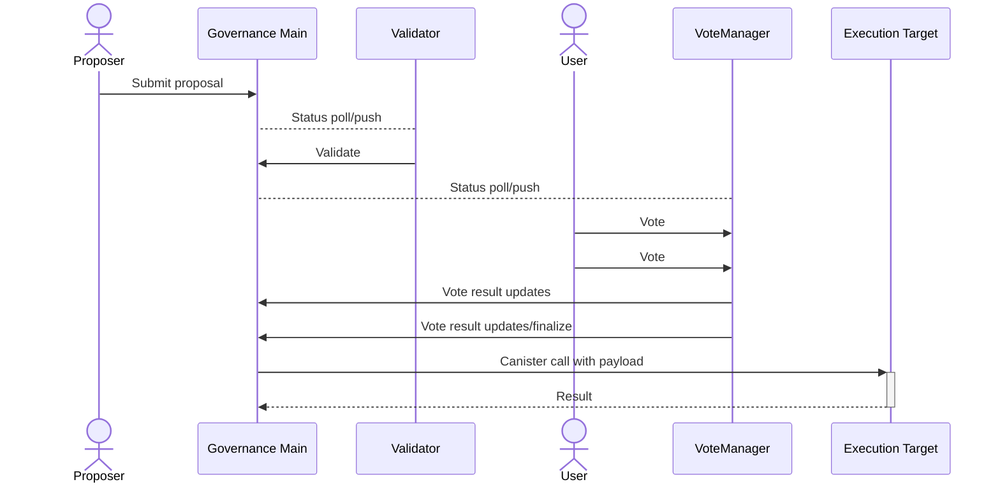

# NX Governance: Modular On-Chain Governance Framework
**Welcome to NX Governance, a cutting-edge multi-chain governance framework built on the Internet Computer.** Our framework is designed with a focus on modularity, transparency, versatility, and security, ensuring every administrative action is auditable and executed via democratic consensus.

🚨🚨🚨 THIS PROJECT IS STILL WIP. DO NOT USE FOR PRODUCTION. 🚨🚨🚨

## 🌟 Key Features
- **Proposal-Centric**: Every action revolves around proposals, ensuring transparency and accountability. This includes canister installs and upgrades, as well as privileged actions such as admin-only functions.
- **Audit Trail**: Comprehensive, auditable log of all proposals, voting outcomes, and execution results.
- **Modular Design**: Integrate custom voting and validation canisters to suit diverse governance needs, without needing to upgrade the main governance canister.
- **Efficient Voting**: While the governance canister maintains only the final results, the detailed voting log is maintained by the voting canister. Complex voting schemes are possible such as staked tokens or NFT/SBT gated voting, crosschain voting, etc.
- **Versatile Execution**: Execution of any payload, including multiple canister calls with data validation and call chaining.
- **Flexible Validation**: Proposal types and validations are managed by a separate validation canister, allowing for custom logic.

## 🛣️ Roadmap
- [ ] Improve test coverage
- [ ] ICRC-1 token staking/voting
- [ ] Security audits
- [ ] IDO
- [ ] Cross-chain execution
- [ ] Cross-chain voting
  
## 🛠️ Setup & Architecture
NX Governance operates on a two-tiered setup:

1. **Governance Root**: An immutable version of the governance framework (blackholed). All roles are delegated to the main governance canister, ensuring immutability while retaining capabilities to use it to upgrade the main governance canister, and keeping an audit trail of all upgrade actions. The security lies in the fact that the logs of the governance root can never be tampered with.
2. **Main Governance**: Canisters of the main governance are controlled by the governance root and can be tailored according to the DAO's requirements. The main governance can upgrade itself through the governance root.

### Upgrading the Governance Module:
To upgrade, submit a proposal in the main governance canister. This proposal should contain payload to submit and execute another proposal in the governance root canister, which contains the payload to upgrade the main governance canister. Exercise caution and ensure thorough verification.

## 🎭 Roles within NX Governance
There are 7 roles in the governance canister:
- **Admin**: Manage roles and other privileged actions via proposals.
- **Proposer**: Initiate new proposals.
- **VoteManager**: Submit voting results for proposals.
- **Validator**: Validate and categorize proposals, setting parameters like voting duration, quorum, and thresholds.
- **Executor**: Execute proposals after successful voting.
- **Revoker**: Revoke proposals during the voting phase. Typically used when there's a security council.
- **ForceExecutor**: Execute proposals anytime during the voting phase. Typically used when there's a security council.
Note that one canister can have multiple roles.

## ⚡️ Proposal Workflow
1. A proposer submits a proposal.
2. A validator validates the proposal, according to the nature of its payload.
3. A validator sets up parameters such as voting period, quorum, and threshold accordingly.
4. Once validated, the proposal goes into the voting period, during which vote managers can submit votes,
revokers can revoke the proposal entirely, and force executors can execute the proposal without waiting for voting results.
5. Once the voting period is over, the proposal is either passed or rejected, depending on the vote results.
6. If the proposal is passed, it goes into the execution phase, during which executors can execute the proposal.

## 🚩 Important Notes
- If execution stops at an intermediate step, there's no mechanism to retry execution. A new proposal needs to be submitted.

## 📖 Documentation
For a deeper dive into NX Governance's architecture, features, and functionalities, please refer to our official documentation. 

## 🚀 Getting Started for Developers
TBD

## 🤝 Contributing
We welcome contributions from the community! Whether it's bug fixes, feature enhancements, or documentation improvements, your input is valuable. Please check our CONTRIBUTING.md guide for more details on how you can be a part of NX Governance's growth.

## 📜 Open Source License
NX Governance is licensed under GNU AGPLv3.

## 📫 Contact & Support
For any queries, suggestions, or feedback, please reach out to us at support@nxfi.app or join our Openchat community.

Thank you for exploring NX Governance. We're committed to providing a transparent, modular, and efficient governance framework for the decentralized world. Feedback and contributions are always welcome!
